<p align="center">
  
</p>

# Bütçe Takip

AI destekli kişisel bütçe takip uygulaması. Gelir-gider kayıtları, kategori bazlı analiz, bütçe limitleri, aylık raporlar, yatırım/döviz araçları ve AI koç ekranlarını tek uygulamada toplar.

## Proje Özeti

Bütçe Takip; Flutter ile geliştirilen mobil/web/masaüstü arayüzünden ve FastAPI tabanlı Python backend servisinden oluşan tam yığın bir uygulamadır. Veriler MongoDB üzerinde tutulur. Harcama kategorisi tahmini için TF-IDF + Logistic Regression tabanlı makine öğrenmesi modeli kullanılır. Kullanıcı geri bildirimleriyle model yeniden eğitilebilir.

## Ekran Görüntüleri

<table>
  <tr>
    <td>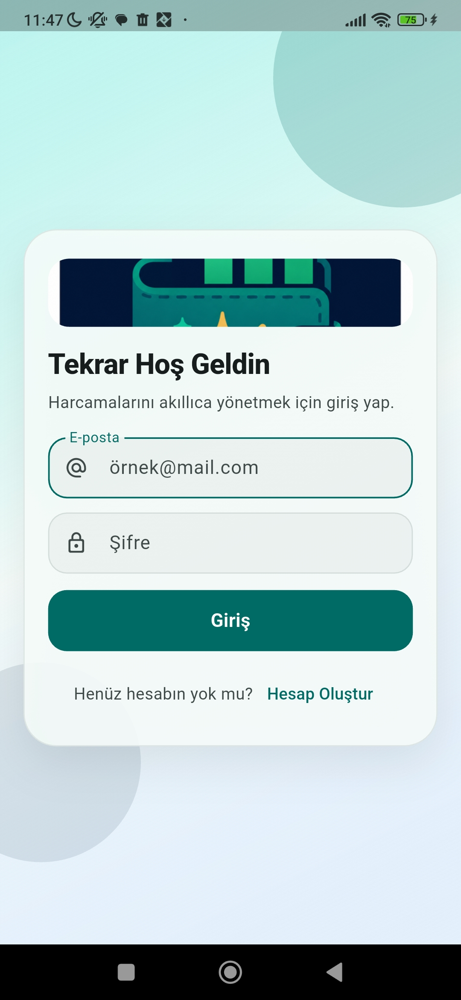</td>
    <td>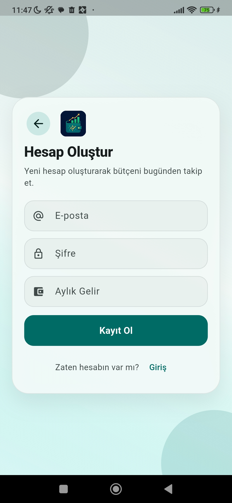</td>
    <td>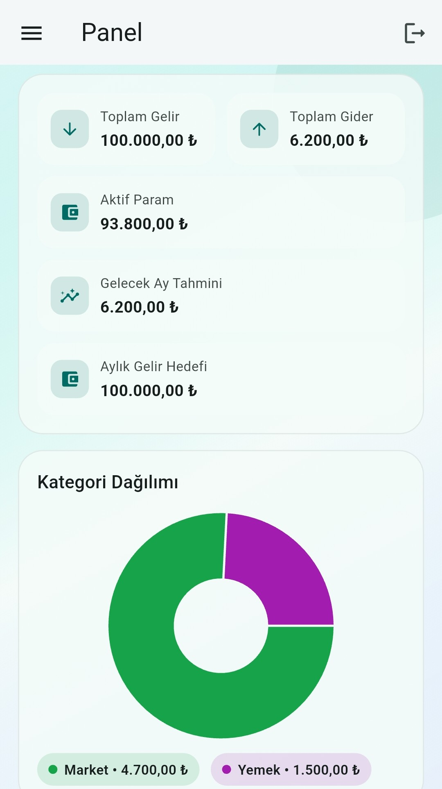</td>
  </tr>
  <tr>
    <td align="center">Giriş</td>
    <td align="center">Kayıt</td>
    <td align="center">Panel</td>
  </tr>
  <tr>
    <td>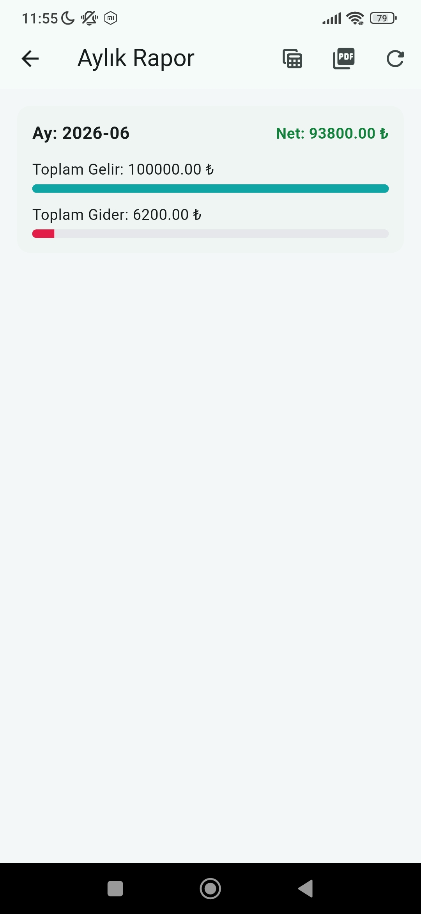</td>
    <td>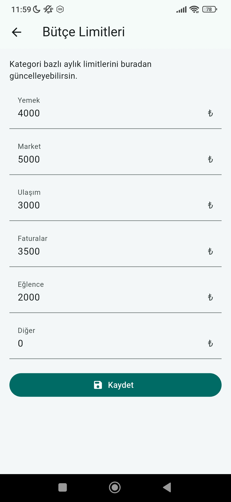</td>
    <td>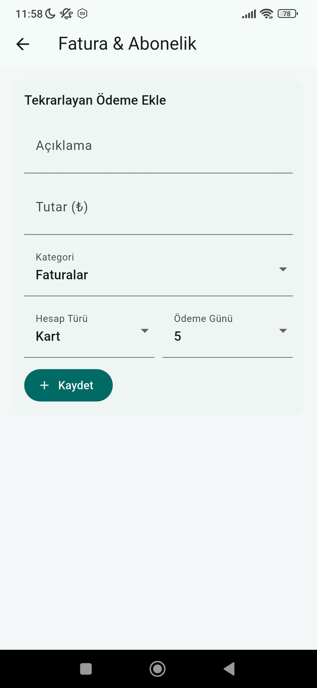</td>
  </tr>
  <tr>
    <td align="center">Aylık Rapor</td>
    <td align="center">Bütçe Limitleri</td>
    <td align="center">Fatura & Abonelik</td>
  </tr>
  <tr>
    <td>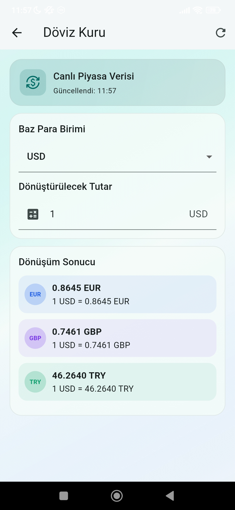</td>
    <td>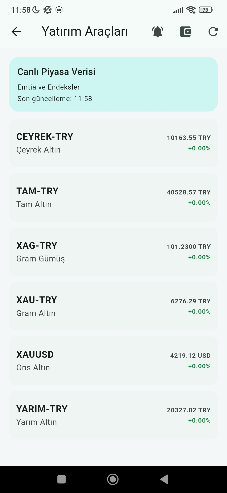</td>
    <td>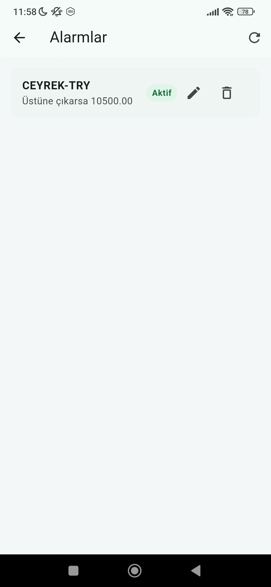</td>
  </tr>
  <tr>
    <td align="center">Döviz Kuru</td>
    <td align="center">Yatırım Araçları</td>
    <td align="center">Yatırım Alarmı</td>
  </tr>
  <tr>
    <td>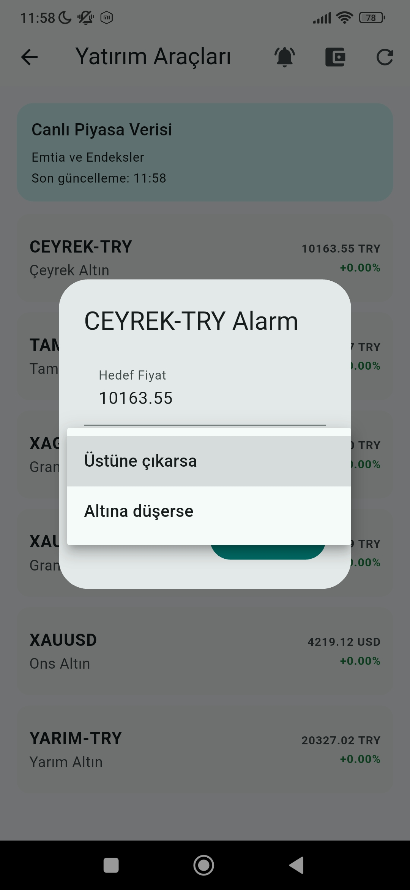</td>
    <td>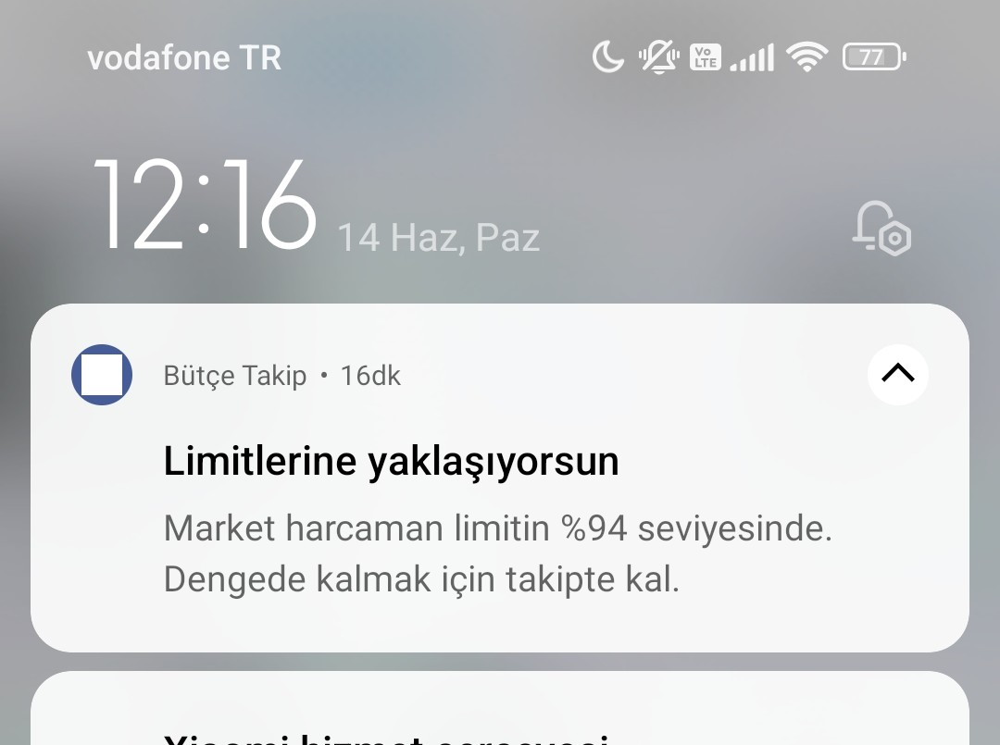</td>
    <td>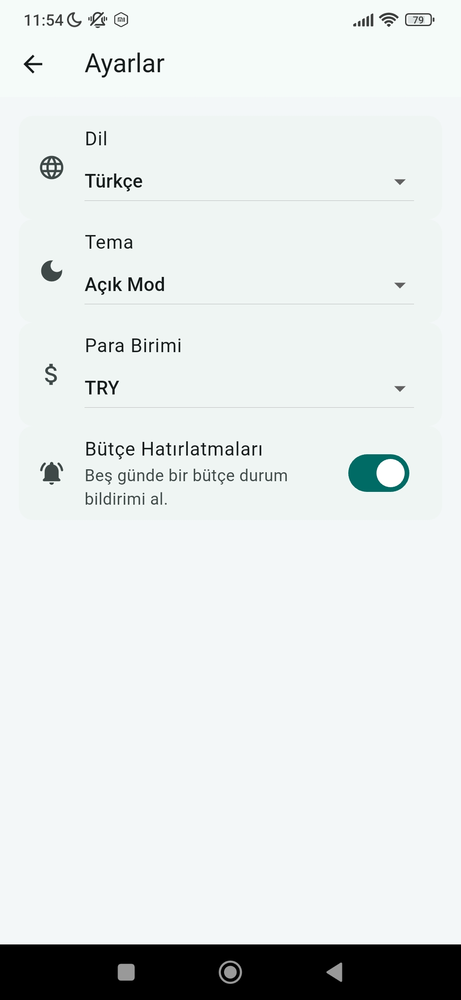</td>
  </tr>
  <tr>
    <td align="center">Alarmlar</td>
    <td align="center">Bildirim</td>
    <td align="center">Ayarlar</td>
  </tr>
</table>

## Özellikler

- Kullanıcı kayıt ve giriş işlemleri
- Başlangıç kurulumu ile gelir, temel gider ve birikim hedefi tanımlama
- Gelir/gider ekleme, listeleme ve silme
- Otomatik kategori tahmini
- Kategori dağılımı ve haftalık analiz
- Aylık rapor ve PDF/hesaplama çıktıları
- Bütçe limitleri ve limit yaklaşma bildirimleri
- Tekrarlayan ödeme/fatura yönetimi
- AI performans metrikleri
- AI koç ile alışveriş/bütçe değerlendirmesi
- Döviz kuru, yatırım araçları, portföy ve fiyat alarmı ekranları
- Türkçe/İngilizce dil desteği, açık/koyu tema ve para birimi ayarları

## Teknoloji Yığını

Backend:

- Python
- FastAPI
- MongoDB
- Motor / PyMongo
- scikit-learn
- pandas
- JWT tabanlı kimlik doğrulama

Frontend:

- Flutter
- Material UI
- fl_chart
- flutter_secure_storage
- shared_preferences
- flutter_local_notifications
- workmanager

## Proje Yapısı

```text
budget_tracker/
  backend/     FastAPI, MongoDB, ML servisleri ve testler
  frontend/    Flutter uygulaması
  docs/        Logo ve ekran görüntüleri
  README.md    Kurulum ve çalıştırma talimatları
```

## Gerekli Yazılımlar

- Python 3.11+
- Flutter SDK
- Android Studio veya Flutter destekli bir IDE
- MongoDB Atlas hesabı veya yerel MongoDB bağlantısı

## Backend Kurulum

```powershell
cd backend
python -m venv .venv
.\.venv\Scripts\activate
pip install -r requirements.txt
```

`backend/.env.example` dosyasını örnek alarak `backend/.env` dosyası oluşturun:

```powershell
Copy-Item .env.example .env
```

`.env` içinde MongoDB bağlantı adresi ve JWT ayarları doldurulmalıdır. Gerçek `.env` dosyası güvenlik nedeniyle repoya veya teslim arşivine eklenmemelidir.

## Backend Çalıştırma

```powershell
cd backend
.\.venv\Scripts\activate
uvicorn app.main:app --reload
```

API:

```text
http://127.0.0.1:8000
```

Swagger:

```text
http://127.0.0.1:8000/docs
```

## Frontend Kurulum

```powershell
cd frontend
flutter pub get
```

## Frontend Çalıştırma

Android emülatör:

```powershell
cd frontend
flutter run --dart-define=API_BASE_URL=http://10.0.2.2:8000
```

Windows/web:

```powershell
cd frontend
flutter run --dart-define=API_BASE_URL=http://127.0.0.1:8000
```

`API_BASE_URL` verilmezse uygulama platforma göre varsayılan backend adresini kullanır.

## Testler

Backend:

```powershell
cd backend
.\.venv\Scripts\activate
pip install -r requirements-dev.txt
python -m pytest tests
```

Frontend:

```powershell
cd frontend
flutter analyze
flutter test
```

## Release APK Oluşturma

```powershell
cd frontend
flutter build apk --release
```

APK çıktısı:

```text
frontend/build/app/outputs/flutter-apk/app-release.apk
```

## Veri Seti Notu

Projede büyük veri seti bulunmamaktadır. ML modeli için kullanılan küçük başlangıç veri seti [backend/app/ml/data/seed.csv](backend/app/ml/data/seed.csv) dosyasında yer alır ve arşive dahil edilebilir. Büyük veri seti kullanılmadığı için ayrıca erişim bağlantısı gerekmemektedir.

## Teslim Arşivi Notu

Teslim için hazırlanacak `.zip` arşivine kaynak kodları ve örnek ayar dosyaları eklenmelidir. Aşağıdaki dosya ve klasörler arşive eklenmemelidir:

- `.git/`
- `.env` ve gerçek gizli ayar dosyaları
- `.venv/`
- `.dart_tool/`
- `build/`
- `__pycache__/`
- `.pytest_cache/`
- log dosyaları
